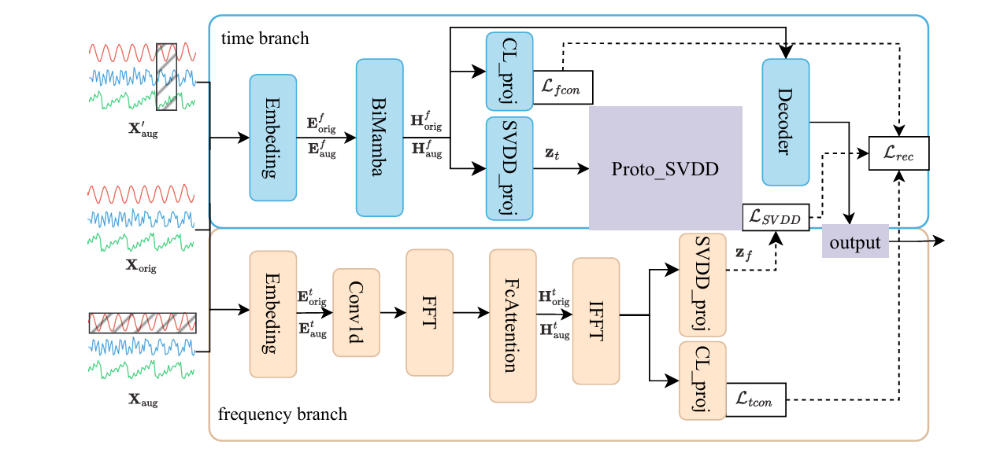

# ProCSAD: Prototype Constraint based Deep SVDD for Time-Frequency Domain Time Series Anomaly Detection

> **ProCSAD** is a robust, unified framework for multivariate time series anomaly detection. By integrating selective state-space modeling with prototype-based hypersphere learning, it effectively captures both complex temporal dynamics and inter-variate dependencies in the time-frequency domain.

<p align="center">
  
</p>

---

## 🌟 Highlights

ProCSAD addresses the challenges of long-range dependencies and complex noise in time series through four key innovations:

- **🚀 BiMamba Temporal Encoder** — Bidirectional selective state-space model (Mamba) for efficient, linear-time modeling of long-range temporal sequences
- **🎯 Prototype-based SVDD (ProtoSVDD)** — Learnable prototype memory with hypersphere boundary for compact normal pattern representation
- **🔄 Dual-branch Reconstruction** — Time-frequency architecture with **ε-tube robust loss** to mitigate outlier impact during training
- **⚖️ Temporal-Frequency Contrastive Learning** — Cross-domain alignment for representation consistency between time and frequency perspectives

---

## 📋 Table of Contents

- [Get Started](#-get-started)
  - [1. Installation](#1-installation)
  - [2. Data Preparation](#2-data-preparation)
  - [3. Training & Evaluation](#3-training--evaluation)
- [Main Results](#-main-results)

---

## 🚀 Get Started

### 1. Installation

**Requirements:**
- Python >= 3.8
- PyTorch >= 1.11.0 (CUDA 11.3+)

```bash
# Clone the repository
git clone https://github.com/your-username/ProCSAD.git
cd ProCSAD

# Install dependencies
pip install -r requirements.txt
```

### 2. Data Preparation

Download benchmark datasets and organize them under `./data/` in `.npy` format:

```
data/
├── MSL/
│   ├── MSL_train.npy
│   ├── MSL_test.npy
│   └── MSL_test_label.npy
├── SMAP/
│   ├── SMAP_train.npy
│   ├── SMAP_test.npy
│   └── SMAP_test_label.npy
├── PSM/
│   └── ...
├── SWaT/
│   └── ...
├── SMD/
│   └── ...
├── NIPS_TS_Water/
│   └── ...
└── NIPS_TS_Swan/
    └── ...
```

**All datasets are well pre-processed.** You can obtain them from the original sources or contact the authors.

### 3. Training & Evaluation

We provide experiment scripts for all benchmarks. Reproduce the results as follows:

```bash
# Run single dataset
bash run.sh NIPS_TS_Water
bash run.sh MSL

# Run multiple datasets
bash run.sh MSL SMAP PSM

# Run all 7 benchmarks
bash run.sh
```

**Default Configuration:**
- **Epochs:** 20
- **Batch Size:** 64
- **Window Size:** 100
- **Runs:** 5 (averaged results)
- **Model:** BiMamba encoder + ProtoSVDD + Contrastive Learning + ε-tube loss

**Evaluation Metrics:**
- Point-adjusted Precision, Recall, F1-score ([Xu et al., 2018](https://arxiv.org/pdf/1802.03903.pdf))
- Affiliation-based Precision, Recall, F1-score

---

## 📊 Main Results

We evaluate ProCSAD on 7 public benchmark datasets. **ProCSAD achieves competitive performance across all benchmarks.**

| Dataset | Dimension | Precision | Recall | F1-Score |
|---------|-----------|-----------|--------|----------|
| PSM | 25 | **99.06** | **98.02** | **98.54** |
| SMAP | 25 | **96.22** | **98.71** | **97.45** |
| MSL | 55 | **93.43** | **96.73** | **95.05** |
| SWaT | 51 | 93.94 | **99.66** | 96.71 |
| SMD | 38 | 90.21 | 93.70 | 91.91 |
| NIPS_TS_Water (GECCO) | 9 | **74.06** | **93.70** | **82.68** |
| NIPS_TS_Swan | 38 | 97.16 | 60.53 | 74.53 |

*Metrics are point-adjusted F1-scores (%) averaged over 5 independent runs. **Bold** indicates best performance.*


